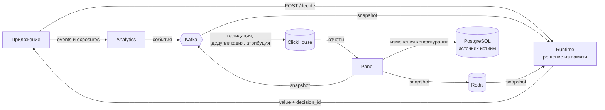

<h1 align="center">
  
</h1>

Self-hosted платформа для feature flags и A/B-тестов. Приложение получает вариант эксперимента одним HTTP-запросом; решение стабильно для пользователя и может быть связано с конверсией через `decision_id`. В платформе также есть таргетинг, ревью запуска, аудит изменений и аналитика событий. Подойдёт командам, которым нужны флаги и эксперименты в собственной инфраструктуре. Проект учебный и не проверялся в production (см. [Статус](#статус)).

## Быстрый старт

Нужны Go 1.27, Docker или Podman и `make`.

`make up` поднимает стек для управления флагами и получения решений. Kafka в `docker-compose.yml` не входит, поэтому аналитический конвейер событий в этом режиме отключён. Для полного стека с Kafka см. [Разработка](#разработка).

**1. Хэш пароля админа.** Panel сравнивает пароль с хэшем Argon2id. Сгенерируйте его утилитой из репозитория:

```bash
git clone https://github.com/faraquic/lotty-ab-platform.git
cd lotty-ab-platform
export BOOTSTRAP_PASSWORD_HASH="$(go run ./tools/hash-password 'my-password')"
```

**2. Запуск.**

```bash
make up      # postgres, redis, s3, миграции, сборка и старт panel/runtime/analytics + ClickHouse, nginx, Prometheus, Loki, Grafana
make logs    # логи
make down    # остановить
```

Админ создаётся при первом старте, если таблица пользователей пуста: `admin@example.invalid` и пароль из шага 1.

Полный контракт всех эндпоинтов лежит в [`docs/openapi/`](docs/openapi/): `panel.yaml`, `runtime.yaml`, `analytics.yaml`.

## Как это работает

| Сервис      | Порт | Что делает                                                                       |
| ----------- | ---- | -------------------------------------------------------------------------------- |
| `panel`     | 8081 | Управление: пользователи и роли, флаги, эксперименты, ревью, метрики, отчёты     |
| `runtime`   | 8082 | `POST /decide`: отвечает, какое значение флага получить конкретному пользователю |
| `analytics` | 8083 | Принимает события и показы, пропускает через Kafka и складывает в ClickHouse     |



Panel публикует snapshot конфигурации в Redis и Kafka, а `runtime` держит его в памяти. Вариант выбирается детерминированно: `xxhash64` от `subject_id` плюс соль версии эксперимента, поэтому один и тот же пользователь всегда попадает в один вариант. В ответе приходит `decision_id`; по нему аналитика связывает конверсию с показом.

## Что реализовано

- **Флаги и эксперименты.** Флаги типов `string`, `number`, `bool`. У эксперимента есть версии, варианты с весами в базисных пунктах и выражение таргетинга (например, `country == 'DE'`).
- **Ревью перед запуском.** Жизненный цикл `draft → review → approved → running → paused / completed → archived`. Согласование идёт через approver-группы, `min_approvals` и комментарии; админ может согласовать сам.
- **Роли и безопасность.** `admin`, `experimenter`, `approver`, `viewer`; пароли на Argon2id, JWT с сессиями в Redis (токен можно отозвать), аудит мутаций в append-only таблице `audit_records`.
- **Runtime.** Ответ из памяти без обращения к PostgreSQL. Если snapshot старше `max_stale_age` (по умолчанию 5 минут), запрос всё равно обслуживается, но с `degraded: true`. Если snapshot ещё не загружался, вернётся `503 SNAPSHOT_UNAVAILABLE`. Если для таргетинга не хватает атрибута, пользователь в эксперимент не попадает.
- **Аналитика.** `POST /events/batch`, `POST /exposures/batch`, `GET /event-types`. Конвейер Kafka с DLQ, дедупликация по `event_id`, атрибуция по `decision_id` (окно 7 дней), хэширование `subject_id` с солью.
- **Метрики и отчёты.** Формулы метрик разбираются собственным парсером и компилируются в запросы ClickHouse; есть отчёт по эксперименту, проверка качества данных и экспорт в CSV.
- **Надёжная доставка.** Transactional outbox для доменных событий, заголовок `Idempotency-Key` на изменяющих запросах panel, повторяющиеся сообщения Kafka безопасны для потребителей.
- **Наблюдаемость.** `/metrics` у каждого сервиса, Prometheus, Loki и три дашборда Grafana.

## Конфигурация

Один JSON-конфиг на все сервисы; шаблон [`config.example.json`](config.example.json) подставляет значения из окружения через `{{ ENV "VAR" }}`. Файл ищется так: `$CONFIG_NAME`, затем `config.local.json`, затем `config.json` (в `.` и `/labp`). Значения по умолчанию заданы в `pkg/config/config.go`.

| Переменная                                                                                                    | Обязательна             | По умолчанию                                           | Описание                                                                               |
| ------------------------------------------------------------------------------------------------------------- | ----------------------- | ------------------------------------------------------ | -------------------------------------------------------------------------------------- |
| `JWT_SECRET_KEY`                                                                                              | да                      | `change-me-local-only` (в Makefile/compose)            | Секрет JWT. При `APP_ENVIRONMENT=prod` значения вида `change-me*` останавливают сервис |
| `BOOTSTRAP_PASSWORD_HASH`                                                                                     | да, для первого входа   | пусто                                                  | Argon2id-хэш пароля первого админа                                                     |
| `APP_ENVIRONMENT`                                                                                             | нет                     | `local` (в Makefile/compose); внутри приложения `prod` | Среда: `prod`, `dev`, `local`                                                          |
| `LOG_LEVEL`                                                                                                   | нет                     | `debug` (в compose)                                    | Уровень логов                                                                          |
| `POSTGRES_DSN`                                                                                                | да                      | задаётся Makefile/compose                              | Подключение к PostgreSQL                                                               |
| `REDIS_ADDRESS`                                                                                               | да                      | `localhost:6379`                                       | Redis: сессии, snapshot, атрибуция, идемпотентность                                    |
| `KAFKA_BROKERS`                                                                                               | для полного стека       | пусто в compose                                        | Без брокеров outbox и конвейер аналитики отключены                                     |
| `CLICKHOUSE_DSN`                                                                                              | для аналитики и отчётов | задаётся compose                                       | Подключение к ClickHouse                                                               |
| `S3_BUCKET`, `S3_REGION`, `S3_ENDPOINT`, `S3_ACCESS_KEY`, `S3_SECRET_KEY`                                     | да                      | `labp`, `us-east-1`, MinIO, `minioadmin`               | Хранилище аватаров                                                                     |
| `PANEL_HTTP_ADDRESS`, `RUNTIME_HTTP_ADDRESS`, `ANALYTICS_HTTP_ADDRESS`                                        | нет                     | `0.0.0.0:8081/8082/8083`                               | Адреса сервисов                                                                        |
| `ANALYTICS_PII_SALT_V1`                                                                                       | да, для `prod`          | `change-me-analytics-salt-v1`                          | Соль хэширования `subject_id`                                                          |
| `ANALYTICS_*_TOPIC`, `ANALYTICS_KAFKA_*_GROUP_ID`, `KAFKA_SNAPSHOT_GROUP_ID`, `RUNTIME_KAFKA_DECISIONS_TOPIC` | для полного стека       | см. `pkg/config/config.go`                             | Топики и группы потребителей Kafka                                                     |

## Технологический стек

| Технология                | Назначение                                                    |
| ------------------------- | ------------------------------------------------------------- |
| Go 1.27                   | Все три сервиса                                               |
| Gin                       | HTTP панели управления                                        |
| Fiber v3                  | HTTP runtime и analytics                                      |
| PostgreSQL 18             | Хранит флаги, эксперименты, ревью, аудит, outbox              |
| Redis 8                   | Сессии, публикация snapshot, атрибуция, ключи идемпотентности |
| Kafka                     | Snapshot, решения, события аналитики, DLQ                     |
| ClickHouse 24             | Хранение событий, показов, решений и атрибутированных событий |
| MinIO (S3)                | Аватары пользователей                                         |
| goose                     | Миграции (`migrations/`)                                      |
| Prometheus, Loki, Grafana | Метрики, логи, дашборды                                       |

## Разработка

Полный стек с Kafka работает на локальных бинарниках, инфраструктура поднимается в контейнерах:

```bash
cp config.example.json config.local.json
# экспортируйте переменные из таблицы выше (POSTGRES_DSN, REDIS_ADDRESS, KAFKA_BROKERS,
# CLICKHOUSE_DSN, S3_*, ANALYTICS_*, JWT_SECRET_KEY, BOOTSTRAP_PASSWORD_HASH и т. д.)
# и CONFIG_NAME=config.local.json

make dev-up          # postgres, redis, s3, kafka, clickhouse, prometheus, loki, grafana
make pg-migrate-up
make run-local       # сборка и запуск panel, runtime, analytics
make stop-local && make dev-down
```

Локальные порты инфраструктуры: PostgreSQL `5433`, Redis `6379`, MinIO `9000`/`9001`, Kafka `9092`, ClickHouse `8123`/`9009`, Prometheus `9090`, Loki `3100`, Grafana `3000`. Полный сброс данных: `make dev-clean`. Прочие цели смотрите в `make help`.

Проверки и тесты, те же, что в CI:

```bash
make check                                     # сборка, go vet, gofmt
go test ./... -short -count=1
make dev-up && make test-e2e                   # e2e и нагрузочный тест
```

E2E работают с отдельной базой `labp_e2e` и отказываются запускаться без `E2E_TEST=1`. Нагрузочный тест (`tests/e2e/runtime/load_test.go`) падает, если p99 у `/decide` превышает 10 мс при 256 соединениях.

Новая миграция: `make pg-migrate-new name=create_foo`. Изменения в HTTP-контрактах вносите в `docs/openapi/` в том же коммите.

Grafana: [localhost:3000](http://localhost:3000), логин `admin` / `admin`. Дашборды: `runtime`, `queues`, `analytics`.

## Статус

Учебный проект: подходит для изучения архитектуры и локального запуска, но не проверялся в production. Ограничения, которые видны по коду:

- **Outbox** используется только для события `experiment.created`; остальные события публикуются напрямую.
- **Guardrails.** Внутренние эндпоинты паузы и отката есть, но автоматического вычисления порогов, которое бы их вызывало, нет.
- **Атрибуция.** Конверсия, пришедшая раньше показа, попадает в атрибуцию только пока не истёк pending; просроченные записываются без эксперимента и варианта.
- **Наблюдаемость.** Часть панелей аналитики пуста, пока в коде не появятся вызовы соответствующих счётчиков; в Loki логи не отправляются, отправителя логов (promtail/Alloy) в проекте нет.
- Нет уведомлений (Telegram/Slack/Discord), ADR-документов, seed-скрипта и e2e-теста аналитического конвейера.
- Таблицы дедупликации `event_idempotency_keys` и `kafka_dedup_keys` не очищаются в фоне.
- CI собирает и тестирует проект, публикации образов и автодеплоя нет.

## Лицензия

MIT, полный текст в [`LICENSE.md`](LICENSE.md).
